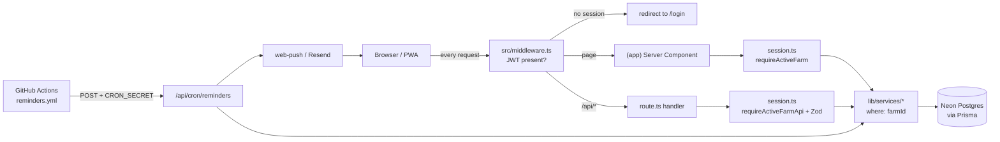

# Architecture overview

A short map of how ChickensFarm is put together, for someone opening the code for the
first time. It describes what the code does today, with file paths to jump to. For the
original plan see [`implementation-plan.md`](implementation-plan.md); for the security
posture see [`security-review.md`](security-review.md); for Sentry and uptime see
[`monitoring.md`](monitoring.md); for release mechanics see [`RELEASE.md`](RELEASE.md).

## System at a glance

- **Next.js 16** App Router + React 19, TypeScript, deployed on **Vercel**.
- **Postgres on Neon**, accessed through **Prisma 7** with the Neon serverless driver
  adapter (`src/lib/prisma.ts`). The client is generated into `src/generated/prisma`
  (gitignored; `npm install` runs `prisma generate`).
- **Auth.js / NextAuth v5 beta**, Credentials provider, JWT sessions.
- **Web Push** (`web-push`, VAPID) and **Resend** email for daily reminders, triggered
  by a **GitHub Actions** schedule.
- **Vercel Blob** for mother-hen photos, **Sentry** for errors and logs.

Code layout that matters:

```
src/middleware.ts          auth redirect gate for every page/API request
src/app/(app)/**/page.tsx  Server Components — read data directly via services
src/app/(auth)/            login, register, forgot/reset password
src/app/api/**/route.ts    route handlers — every mutation goes through here
src/lib/session.ts         who is the user, which farm are they acting on
src/lib/services/*.ts      all Prisma access, always scoped by farmId
src/lib/validation/*.ts    Zod schemas shared by forms and route handlers
prisma/schema.prisma       data model; prisma/migrations/ is the history
public/sw.js               service worker (push + installability)
```

There are no Server Actions: client forms (`src/components/forms/*`) `fetch` the JSON
route handlers, then `router.refresh()`.



## Multi-tenant data model

**Tenant = `Farm`.** A `User` can belong to many farms through `FarmUser`
(`@@unique([farmId, userId])`, `role: OWNER | WORKER`). `Farm.ownerId` records the
creator; `createFarm` in `src/lib/services/farms.ts` creates the farm and an `OWNER`
membership in one transaction. Farms are soft-deleted (`deletedAt`), and every
membership lookup filters `deletedAt: null`.

Every business table carries a `farmId` column with `onDelete: Cascade` and an index
led by `farmId` (usually `[farmId, <date>]`): `Breed`, `BirdGroup`, `BirdGroupEvent`,
`MotherHen`, `EggCollection`, `EggSale`, `EggConsumption`, `Loss`, `Expense`,
`BirdTransaction`, `IncubationCycle`. Two child tables have **no** `farmId` and are
reached only through a scoped parent: `MotherHenLog` (via `MotherHen`) and
`IncubationGrowthLog` (via `IncubationCycle`). User-level tables (`NotificationSetting`,
`PushSubscription`, `PasswordResetToken`) are scoped by `userId`, not by farm.

Bird head counts have a single writer: `adjustBirdGroupQuantityTx` in
`src/lib/services/bird-groups.ts`. It re-checks the group against `farmId`, refuses to
go negative, applies an optimistic-concurrency `updateMany` (`where: { id, quantity }`
→ `ConcurrentModificationError` / HTTP 409), and appends a `BirdGroupEvent` audit row.
Losses, bird purchases/sales and hatches all move quantities through it.

### How scoping is enforced (two layers)

1. **Which farm — resolved server-side** (`src/lib/session.ts`). The active farm id
   lives in an httpOnly `activeFarmId` cookie. `resolveActiveFarm` only honours it if
   the farm is in the user's own membership list (otherwise it falls back to the first
   farm). Pages call `requireActiveFarm()` (redirects to `/login` or `/farms/new`);
   route handlers call `requireActiveFarmApi()` (throws `ForbiddenError` → 403).
   Routes that take a farm id from the URL (`/api/farms/[farmId]`, `/api/active-farm`,
   `/farms/[farmId]/settings`) use `requireFarmAccess(Api)(farmId, { minRole })`,
   which re-checks membership for that id. **No farm id travels in data URLs.**
2. **Which row — checked in the service layer.** Every service takes `farmId` first.
   Reads use `findFirst({ where: { id, farmId } })`; updates/deletes run that lookup and
   throw `ValidationError` (→ 400) before mutating by id. Cross-links a client can send
   (`birdGroupId`, `breedId`, `eggSourceGroupId`, …) are verified against the same farm
   before being written.

`handleApiError` in `src/lib/api-utils.ts` maps these errors to status codes in every
route. The pattern is exercised without a database by
`src/lib/services/multi-tenant-isolation.test.ts`, which runs the real services against
an in-memory Prisma fake (`src/lib/services/fake-prisma.ts`) that evaluates `where`
clauses. Reviewers also enforce it via `.coderabbit.yaml`.

## Auth flow

- **Registration** — `POST /api/auth/register` → `registerUser` in
  `src/lib/services/auth.ts` (bcrypt cost 12). The user has no farm yet, so the first
  authenticated page redirects to `/farms/new`.
- **Login** — Credentials provider in `src/lib/auth.ts`: rate limit per IP and per email
  (8 / 10 min, `src/lib/rate-limit.ts`), `prisma.user.findUnique({ email })`,
  `bcrypt.compare`. On success NextAuth issues a **JWT session cookie**; there is no
  session table. The `jwt`/`session` callbacks in `src/lib/auth.config.ts` copy `user.id`
  into the token and onto `session.user.id` (typed in `src/lib/auth-types.d.ts`).
- **Split config** — `src/lib/auth.config.ts` is the provider-less, Edge-safe subset
  (no Prisma, no bcrypt) used by `src/middleware.ts`; `src/lib/auth.ts` spreads it and
  adds the Credentials provider. `src/app/api/auth/[...nextauth]/route.ts` exports the
  handlers.
- **Gate** — `src/middleware.ts` only checks that a valid JWT exists: signed-out
  requests go to `/login?callbackUrl=…`, signed-in users are bounced away from
  `/login`, `/register`, `/forgot-password`, `/reset-password`. `/privacy` is open to
  both. The `matcher` excludes `api/auth`, `api/cron`, `api/health`, `sw.js`, static
  assets and the manifest (the comments there explain why each one).
- **Authorization** happens after the gate, per request, in `src/lib/session.ts`
  (`requireUser`, `requireActiveFarm`, `requireFarmAccess` and their `…Api` variants) —
  see the tenancy section above.
- **Password reset** — `POST /api/auth/password-reset` stores a SHA-256 hash of a
  32-byte random token (1 h TTL, single use via `usedAt`) and emails the link via
  Resend (`src/lib/email.ts`); it always answers `{ ok: true }`. `PATCH` with the token
  sets the new hash and marks the token used in one transaction. Both the request and
  register endpoints are rate limited.
- **Machine callers** — `/api/cron/reminders` and `/api/health` bypass the session.
  The cron route requires `Authorization: Bearer $CRON_SECRET` (`timingSafeEqual`);
  health answers anyone but only returns detail to a caller holding that secret.

## Push notification design

Push is one delivery channel of the **daily reminder** ("you have not logged eggs
today"); email is the other. The user-facing behaviour and setup checklist are in the
[README "Daily reminders" section](../README.md#daily-reminders).

**Storage** (`prisma/schema.prisma`)

- `PushSubscription` — one row **per device**, `endpoint` unique, plus `p256dh`/`auth`
  keys, `userAgent`, `lastUsedAt`.
- `NotificationSetting` — one row per user: `enabled`, `message`, `sendTime` (`HH:mm`),
  IANA `timeZone`, `emailEnabled`, `pushEnabled`, optional `email`, and `lastRunOn`
  (local date last handled) / `lastSentAt`.

**Subscribe path**

1. The Telefone toggle (`src/components/forms/notification-settings-form.tsx`) calls
   `enablePush(vapidPublicKey)` in `src/lib/push-client.ts`. The VAPID public key is
   read from env per request and passed down as a prop, never inlined in the bundle.
2. `enablePush` classifies support (`classifyPushSupport` in `src/lib/push-utils.ts` —
   iOS needs the PWA installed), requests permission inside the click, registers
   `/sw.js`, drops a subscription made with a rotated VAPID key, subscribes, and POSTs
   `{ endpoint, keys }` to `/api/push/subscribe`. On a server error it unsubscribes
   locally so browser and DB never disagree.
3. `src/app/api/push/subscribe/route.ts` validates with `src/lib/validation/push.ts`
   (endpoint host must be a known push service — SSRF guard, #137) and calls
   `savePushSubscription` (`src/lib/services/push-subscriptions.ts`): an **upsert on
   `endpoint`** that also re-points the row at the current user, and sets
   `pushEnabled = true`. `DELETE` removes the caller's row and turns `pushEnabled` off
   when no devices remain.

**Send path**

1. `.github/workflows/reminders.yml` POSTs `/api/cron/reminders` at minutes 7/22/37/52
   of every hour (GitHub rather than Vercel Cron, whose Hobby plan allows one run/day).
2. `runReminderBatch` in `src/lib/services/reminders.ts` loads enabled settings (max
   500), and `evaluateDue` in `src/lib/notification-schedule.ts` decides per user in
   their own time zone. A due reminder stays deliverable for the rest of that local day,
   because GitHub drops many scheduled ticks.
3. Due users are grouped by local date; `loadDataPresence`
   (`src/lib/services/data-presence.ts`) checks for an egg collection that day in **any**
   live farm the user belongs to (the cron cannot see the active-farm cookie).
4. The day is **claimed before sending** with a compare-and-set
   `updateMany … where lastRunOn < today` — at-most-once, so overlapping runs never
   double-send.
5. Email and push are attempted independently; `sendPushToUser` in `src/lib/push.ts`
   sends to every device in parallel, deletes subscriptions answering **404/410**, keeps
   everything else (403 usually means a VAPID key problem), and bumps `lastUsedAt`.
   Endpoints are never logged in full (they are capability URLs).
6. `public/sw.js` shows the notification (`tag` collapses repeats) and on click focuses
   an open window or opens the same-origin path from the payload
   (`/eggs/collections/new`).

`POST /api/notifications/test` sends through the same functions but never touches
`lastRunOn`, and always emails the caller's own saved address (#136). Missing VAPID env
vars disable push with a single warning instead of failing the batch.

## Financial calculations

**Where money lives.** Four `Decimal(10,2)` columns, all EUR (there is no currency
column; the app is single-currency):

- `EggSale.unitPrice` / `totalAmount` — income.
- `BirdTransaction.unitPrice` / `totalAmount` with `type: SALE | PURCHASE` — income or
  expense from the same table.
- `Expense.amount` with `category` (`FEED`, `VITAMINS`, `MEDICINE`, `PRODUCTIVITY`,
  `OTHER`) — expense.

**Writing.** Zod schemas accept a comma or dot decimal (`parseDecimalInput` in
`src/lib/format.ts`). Services compute `totalAmount = input.totalAmount ?? quantity ×
unitPrice` (`src/lib/services/egg-sales.ts`, `resolveTotal` in
`src/lib/services/bird-transactions.ts`); the **total is stored**, so a hand-agreed
price survives later edits. Numbers are passed to Prisma as JS floats and **Postgres
rounds them to 2 decimals on insert** — there is no explicit rounding in app code. The
egg sale form works in tens (`src/components/forms/egg-sale-form.tsx`) and sends
`unitPrice = pricePerTen / 10`, `quantity = tens × 10`. Bird transactions also adjust
the linked group's head count inside the same DB transaction.

**Reporting.** `getProfitLossReport` in `src/lib/services/reports.ts` (P&L page
`src/app/(app)/finance/profit-loss/page.tsx`):

- income = egg sales + bird sales; expenses = `Expense` rows + bird purchases;
  profit = income − expenses.
- Aggregates run in Postgres (`aggregate` / `groupBy` by exact date, indexed on
  `[farmId, date]`), then are converted with `toCents` and summed in **integer cents**
  in `src/lib/finance-math.ts` so month rows add up to the totals. `buildMonthlyTotals`
  buckets by **UTC** month, because `@db.Date` values come back at `00:00Z`.
- Covered by `src/lib/finance-math.test.ts`.

Other money readers: the dashboard (`src/lib/services/dashboard.ts`: this month / this
year), the expense category report (`getExpensesByCategoryReport` in
`src/lib/services/expenses.ts`) and egg revenue in `getEggStockReport`. Display always
goes through `formatEUR` (`Intl.NumberFormat("lt-LT", EUR)`).

## Where to start / gotchas

- **Adding a farm-scoped feature:** model with `farmId` + `[farmId, date]` index →
  migration → Zod schema in `src/lib/validation/` → service taking `farmId` first with
  `{ id, farmId }` lookups → route handler that starts with `requireActiveFarmApi()` and
  ends in `handleApiError` → add cases to `multi-tenant-isolation.test.ts`.
- **This Next.js has breaking changes** (see `AGENTS.md`); read
  `node_modules/next/dist/docs/` before relying on memory. Route `params` are Promises.
- **Dates** are `@db.Date` and must be handled in UTC (`formatDateLT` uses
  `timeZone: "UTC"`); reminder logic uses the user's IANA zone instead.
- **The UI is Lithuanian**, code and docs are English. Error messages returned by the
  API are user-facing Lithuanian strings.
- **CI** (`.github/workflows/ci.yml`) runs Prettier on changed files, ESLint,
  `npm run typecheck`, Vitest, `npm audit` and waits for the Vercel preview build. It
  has no database — tests use fakes. Production migrations run in `vercel-build`.
- **Reminders run only from the default branch** and GitHub disables the schedule after
  60 days without activity.

## Known gaps

Found while writing this; not fixed here.

- **Middleware file name is deprecated.** Next.js 16 renamed `middleware.ts` to
  `proxy.ts` (which defaults to the Node.js runtime). The app still uses
  `src/middleware.ts`; migrating may also make the Edge-safe `auth.config.ts` split
  unnecessary.
- **`minRole` is an equality check, not a hierarchy.** `requireFarmAccess(…, { minRole })`
  filters `role: minRole`, which is only correct because `OWNER` is the sole value used.
  Passing `WORKER` would lock owners out.
- **No membership management.** `FarmUser` rows are only created by `createFarm`, so the
  `WORKER` role and multi-user farms exist in the schema but cannot be set up from the
  app.
- **Active farm is a cookie, not part of the request.** After switching farms in one
  tab, a form submitted from another open tab creates its record in the newly active
  farm (edits by id fail with 400 instead).
- **JWT sessions are not revocable.** A password reset does not invalidate existing
  sessions, and `requireUser` trusts `session.user.id` without checking the user still
  exists.
- **Email addresses are case-sensitive.** Register and login use the trimmed email as
  typed, so `A@x.lt` and `a@x.lt` are different accounts.
- **Rate limiting is in-memory per instance** (`src/lib/rate-limit.ts`, see #135), so it
  weakens when Vercel runs several instances.
- **Money rounding is implicit.** No schema limits prices to 2 decimals; Postgres rounds
  on insert. A price per ten like `1.25` stores `unitPrice` `0.13` (the stored total is
  still right). The dashboard and category reports add `Number(...)` floats instead of
  the cents helpers used by the P&L report.
- **Uploaded photos are public Blob URLs** and `photoUrl` accepts any URL; photos are not
  farm-scoped once the link is known.
